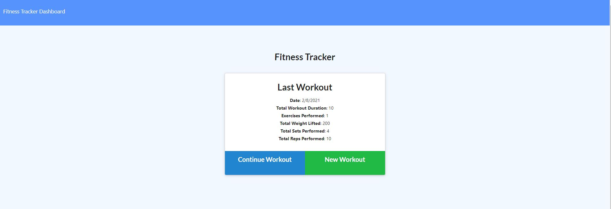

# Workout Tracker


## Table of Content

  - [Description](#description)

  - [Installation](#installation)

  - [Usage](#usage)

  - [Licence](#licence)

  - [Contributing](#contributing)

  - [Questions](#questions)

 ### Description

 Workout Tracker is a fitness app that lets users view, create and track daily workouts. Users are able to log multiple exercises in a workout on a given day. They can track the name, type, weight, sets, reps, and duration of exercise. If the exercise is a cardio exercise, they will be able to track the distance traveled. 

 The app is built using Node, MongoDB, Mongoose, Express, and Morgan.

 The live app can be accessed [here](https://pacific-stream-43723.herokuapp.com/).

 <p align="center">
    
</p>
 <p align="center">
    
</p>


### Installation

The application can be installed by using the following command: 

```bash
git clone https://github.com/caymanh/workout-tracker.git
```

### Usage

The application can be invoked by using the following commands: 

```bash
npm install
node server.js
```

### Licence

This application is covered by the [MIT](https://choosealicense.com/licenses/mit/) licence.

### Contributing

Pull requests are welcome. For major changes, please open an issue first to discuss what you would like to change.

### Questions

Please contact me if you have any questions regarding the application:

[Github](https://github.com/caymanh)

[Email](mailto:hengcayman@gmail.com)
